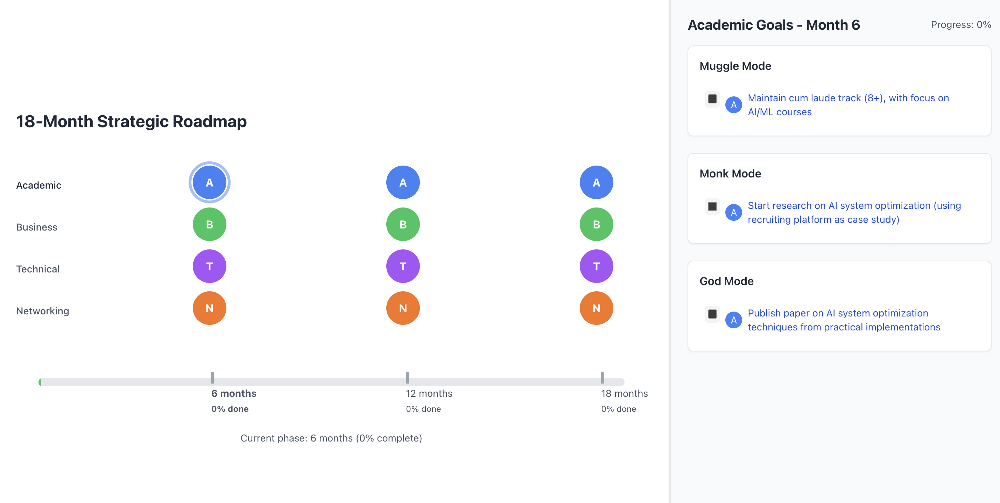

# Strategic Roadmap Tracker

A visual and interactive 18-month strategic roadmap tracker built with React. Track your professional development goals across different areas and difficulty levels.

## 🌟 Features

- 🎯 Track goals across multiple areas (Academic, Business, Technical, Networking)
- 📊 Visual progress tracking with interactive timeline
- 🎚️ Three difficulty levels (Muggle, Monk, God mode)
- 📱 Fully responsive design
- 💾 Local storage persistence
- 🎨 Color-coded goal categories
- 📈 Progress tracking up to 300% (100% per difficulty level)

## 🚀 Demo

Visit the live demo: [Strategic Roadmap Tracker](https://your-username.github.io/roadmap-tracker)



## 📦 Deployment

### Publishing to GitHub Pages

1. Update your repository settings:
   - Go to your repository on GitHub
   - Navigate to Settings > Pages
   - Under "Source", select "GitHub Actions"

2. Add this GitHub Actions workflow file at `.github/workflows/deploy.yml`:
```yaml
name: Deploy to GitHub Pages

on:
  push:
    branches: [ main ]
  workflow_dispatch:

jobs:
  build-and-deploy:
    runs-on: ubuntu-latest
    steps:
      - uses: actions/checkout@v2

      - name: Setup Node.js
        uses: actions/setup-node@v2
        with:
          node-version: '18'

      - name: Install Dependencies
        run: npm install

      - name: Build
        run: npm run build

      - name: Deploy to GitHub Pages
        uses: JamesIves/github-pages-deploy-action@4.1.5
        with:
          branch: gh-pages
          folder: dist

permissions:
  contents: write
```

3. Update your `vite.config.js`:
```javascript
import { defineConfig } from 'vite'
import react from '@vitejs/plugin-react'

export default defineConfig({
  plugins: [react()],
  base: '/your-repo-name/', // Replace with your repository name
})
```

4. Add these scripts to your `package.json`:
```json
{
  "scripts": {
    "predeploy": "npm run build",
    "deploy": "gh-pages -d dist"
  }
}
```

5. Install the gh-pages package:
```bash
npm install --save-dev gh-pages
```

6. Push your changes to GitHub:
```bash
git add .
git commit -m "Configure GitHub Pages deployment"
git push
```

Your site will be available at `https://your-username.github.io/your-repo-name/`

## 🛠️ Installation

1. Clone the repository:
```bash
git clone https://github.com/your-username/roadmap-tracker.git
cd roadmap-tracker
```

2. Install dependencies:
```bash
npm install
```

3. Start the development server:
```bash
npm run dev
```

## 📝 Usage

### Goal Structure

Goals are organized in the `goals.js` file with the following structure:

```javascript
export const goals = {
  6: {  // 6-month mark
    muggle: [
      { id: "6-m-1", area: "Academic", text: "Complete online course X" },
      // ... more goals
    ],
    monk: [
      // ... monk level goals
    ],
    god: [
      // ... god level goals
    ]
  },
  12: {  // 12-month mark
    // ... similar structure
  },
  18: {  // 18-month mark
    // ... similar structure
  }
};
```

### Customizing Goals

1. Copy the `goals.template.js` file to `goals.js`
2. Edit the goals according to your strategic plan
3. Maintain the structure while adding your custom goals

## 🎨 Customization

### Areas

The default areas are:
- Academic (Blue)
- Business (Green)
- Technical (Purple)
- Networking (Orange)

You can modify areas in the `areas` object within `RoadmapTracker.jsx`.

### Time Periods

The tracker is set up for 18 months with checkpoints at:
- 6 months
- 12 months
- 18 months

## 📊 Progress Calculation

Progress is calculated as follows:
- Completing all Muggle mode goals = 100%
- Completing all Monk mode goals = Additional 100%
- Completing all God mode goals = Additional 100%
- Maximum possible progress = 300%

## 🤝 Contributing

1. Fork the repository
2. Create your feature branch (`git checkout -b feature/AmazingFeature`)
3. Commit your changes (`git commit -m 'Add some AmazingFeature'`)
4. Push to the branch (`git push origin feature/AmazingFeature`)
5. Open a Pull Request

## 🙏 Acknowledgments

- Built with React and Tailwind CSS
- Inspired by professional development roadmaps

## 📞 Contact

Nicolas Zumarraga - [@nicozumarraga](https://www.linkedin.com/in/nicolaszumarragaf/)

Project Link: [https://github.com/nicozumarraga/roadmap-tracker](https://github.com/nicozumarraga/roadmap-tracker)
